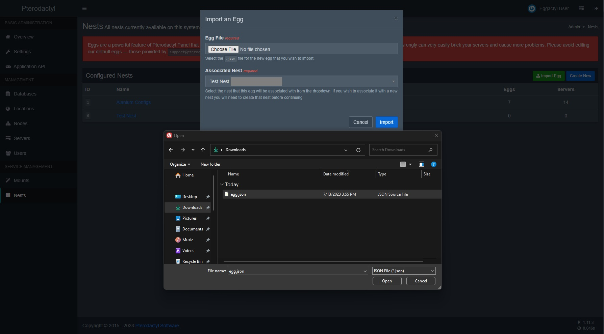

import { LinkCard } from '@astrojs/starlight/components';

### Requirements
<LinkCard title="Pterodactyl" description="Click me to be brought to the installation guide for Pterodactyl." href="https://pterodactyl.io/panel/1.0/getting_started.html" target="_blank" />

#### Download Egg file
<LinkCard title="Egg File Download" href="https://cdn.eggactyl.cloud/files/egg.json" />

#### In your panel, go to the Nests section in the admin panel.

#### Click the green "Import Egg" button.

#### Choose the JSON file that you downloaded earlier.

#### Select the nest you want to put the egg into.

#### Press Import!
