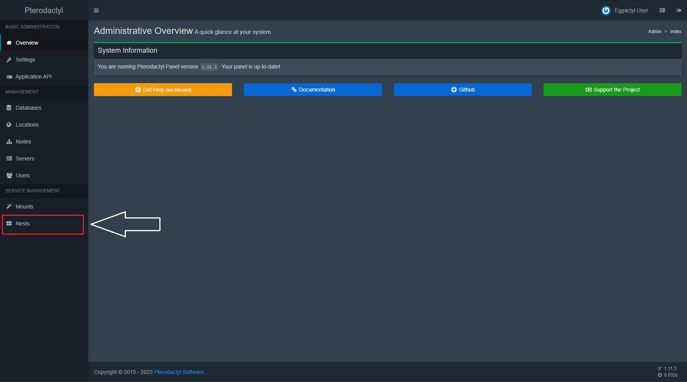
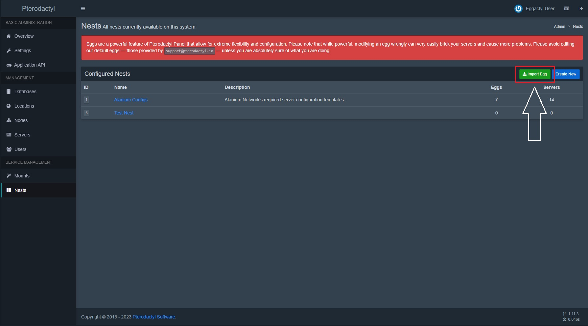
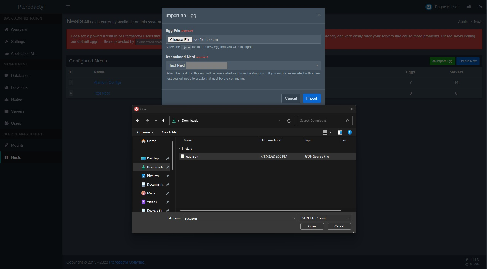

import { LinkCard } from "@astrojs/starlight/components";

### Prérequis

<LinkCard
  title="Pterodactyl"
  description="Cliquez ici pour voir le guide d'installation de Pterodactyl."
  href="https://pterodactyl.io/panel/1.0/getting_started.html"
  target="_blank"
/>

#### Téléchargement du fichier de l'egg

<LinkCard
  title="Téléchargement du fichier de l'egg"
  href="https://cdn.eggactyl.cloud/files/egg.json"
/>

#### Dans le panel de Pterodactyl, cliquez sur "Nests" dans la barre latérale.

#### Cliquez sur le bouton "Import Egg" en haut à droite.

#### Choissisez le fichier que vous avez téléchargé précédemment.

#### Choissisez le nest dans lequel vous voulez ajouter l'egg.

#### Cliquez sur "Import".
