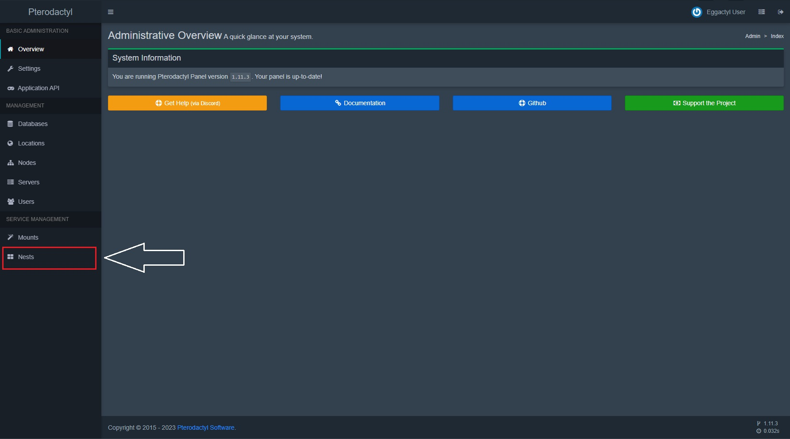

### Requirements
- Pterodactyl Panel | [Installation Guide for Pterodactyl](https://pterodactyl.io/panel/1.0/getting_started.html)

#### Download Egg file
Download the egg.json file <a href="https://cdn.eggactyl.cloud/files/egg.json" download target="_blank">here.</a>

#### In your panel, go to the Nests section in the admin panel.

#### Click the green "Import Egg" button.

#### Choose the JSON file that you downloaded earlier.

#### Select the nest you want to put the egg into.

#### Press Import!
